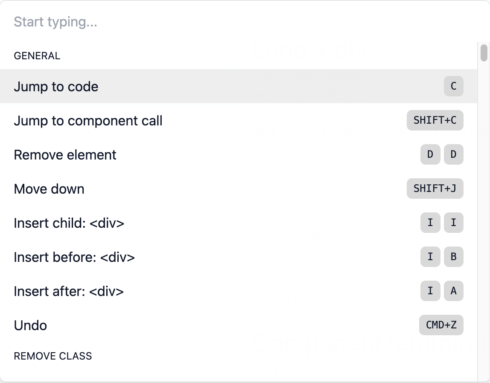

# Impulse: yes-code UI editor (alpha)

[impulse.dev](https://impulse.dev) | [Discord](https://discord.gg/RbVE8cj9)

Made by [@krogovoy](https://twitter.com/krogovoy) and [@IVolchenskov](https://twitter.com/IVolchenskov)

<!-- TODO video link -->

Impulse is a visual UI editor for developers that use React and Tailwind.

<br />


[Watch full demo (40:22)](https://youtu.be/QaTSsaGXCco)

<br />

It allows you to edit your UI right in the browser while automatically changing your code precisely the way you would do it manually.

- Built into your app: no need to install any extensions or desktop apps
- No external services, works directly with the code
- Made exclusively for developers, not designers
- Addon, not a replacement: gives you a new tool while not taking anything away

Compared to writing code manually:

- Faster
- More fun
- Same code produced

Features:

- Select any DOM element and jump straight to its code in your editor
- Add new markup visually without leaving the browser
- Make edits to any existing DOM element with all changes saved to code automatically

## Requirements

Languages:

- ✅ Javascript
- ✅ Typescript (typings built in)

Rendering libraries:

- ✅ React 17+
- ⬜️ Vue (possibly in the future)
- 🚫 Svelte (no plans for support)
- 🚫 Angular (no plans for support)

React frameworks and bundlers:

- ✅ Next.js
- ✅ Create React App
- ✅ Vite
- ⬜️ Remix
- ⬜️ esbuild (https://github.com/evanw/esbuild/issues/2318)
- ⬜️ Parcel
- ✅ any custom system built on top of Babel/Webpack/Rollup

CSS frameworks:

- ✅ Tailwind
- 🚫 no plans to support other CSS frameworks for now

Browsers:

- ✅ Chromium-based
- 🚫 Firefox
- 🚫 Safari

(Impulse relies on [File System Access API](https://developer.mozilla.org/en-US/docs/Web/API/File_System_Access_API) which only works well in Chromium-based browsers)

Editor integration:

- ✅ VS Code
- ⬜️ more coming

## Install

There are three ways to try Impulse.

### Option 1: Try now

Copy and paste the code below into your browser's console.

```js
d=document;s=d.createElement('script');s.src=`https://cdn.jsdelivr.net/npm/@impulse.dev/runtime@latest/inject.js?${Date.now()}`;d.body.appendChild(s)
```

Easy way to play with the tool without installing anything, but obviously, it will go away once you refresh the page.

### Option 2: npm (recommended)

```sh
npm i -D @impulse.dev/runtime@latest
```

Paste into any file that always gets imported. Usually it'll be the "main" React file, such as `_app.jsx` in Next.js.

```js
if (process.env.NODE_ENV === 'development') {
  import('@impulse.dev/runtime').then((impulse) => impulse.run())
}
```

### Option 3: a <script> tag

Paste this script tag at the end of `<body>`

```jsx
{
  process.env.NODE_ENV === 'development' && (
    <script src="https://cdn.jsdelivr.net/npm/@impulse.dev/runtime@latest/inject.js"></script>
  )
}
```

IMPORTANT: make sure you are not shipping Impulse in your production build! It will bloat your bundle size!

Most bundlers cut out all the code inside an `if (process.env.NODE_ENV === 'development') { ... }`, but it's recommended to make a production build and compare the bundle size to what it was before.

## Setup

### Browser

If you are using Brave, enable File System Access API:

1. Go to brave://flags
2. Search for `file system access api`
3. Change it to "Enabled"

Impulse only works if you run your development environment on the same computer that you use the browser. Impulse doesn't work with remote environments because it can't edit files on other computers.

For security reasons, File System Access API only works for `localhost` when http:// is used. If you are using a different hostname even though the environment is local, you should:

1. Go to chrome://flags
2. Search for `Insecure origins treated as secure`
3. Add your origin (e.g. http://my_origin) to the list

### Prettier

Impulse edits your files and uses Prettier for formatting.

However, it can't get access to your Prettier config as it's a browser-only Node-less environment.

To fix it, you can pass it your config:

```diff
if (process.env.NODE_ENV === 'development') {
-  import('@impulse.dev/runtime').then((impulse) => impulse.run())
+  import('@impulse.dev/runtime').then((impulse) => impulse.run({
+    prettierConfig: require('path_to_prettier_config')
+  }))
}
```

## Use

IMPORTANT: Impulse is at the alpha stage. Although not likely, assume that it can unrecoverably ruin your codebase. Make sure to have a backup and/or a clean git state.

[Watch full demo (40:22)](https://youtu.be/QaTSsaGXCco)

- Option/Alt+Click to select any element on the page
- Esc to remove selection
- Arrow keys or h, j, k, l for keyboard navigation
- Space or Enter to open the command bar
- Use the command bar or the hotkeys (specified on the right for each action) to perform actions



What you can do:

- Jump to the code of the selected element
- Jump to where the React component of the selected element is called
- Add or remove a class (so far only works if the list of classes in the code is hardcoded with no conditions)
- Remove the element
- Insert a new `<div></div>`
- Change the tag of the element (e.g. div -> p)
- Insert a new text
- Move elements (swap with the previous/next sibling)
- Undo the latest change

## Get help or share feedback

- [Discord server](https://discord.gg/RbVE8cj9)
- [Discussions on Github](https://github.com/kirillrogovoy/impulse/discussions)

## Contribute

Requirements:

- node 16+
- npm 8.9.0+

Clone the repo:

```sh
git clone git@github.com:kirillrogovoy/impulse.git && cd impulse
```

Install dependencies:

```sh
npm install
```

Run the dev server:

```sh
npm run dev
```

Open http://localhost:3005/. This is a playground for developing and testing the app.
