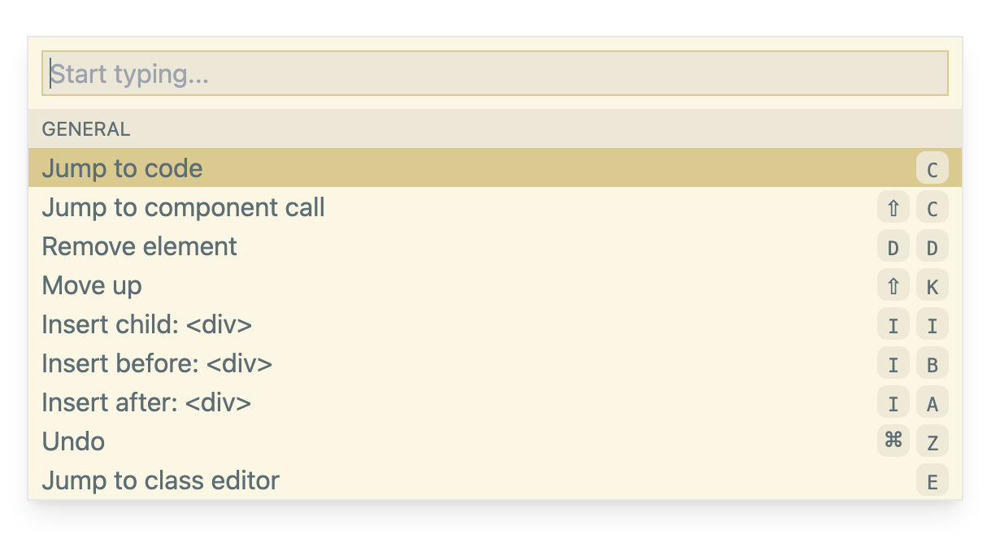

# Impulse: Impossible Dev Tools for React and Tailwind

Build modern websites right in your browser without giving up on code.

[impulse.dev](https://impulse.dev) | [Discord](https://discord.gg/nDDCyyedbs)

Made by [@krogovoy](https://twitter.com/krogovoy) and [@IVolchenskov](https://twitter.com/IVolchenskov)

Impulse allows you to edit your UI right in the browser while automatically changing your code precisely the way you would do it manually. It's like a code editor extension that goes beyond the code editor.

- Built into your app: no need to install any extensions or desktop apps
- No external services, works directly with the code
- Made exclusively for developers, not designers
- Addon, not a replacement: gives you a new tool while not adding any boundaries

🍿 See demos at [impulse.dev](https://impulse.dev)

Compared to writing code manually:

- Faster
- More fun
- Same code produced

## Requirements

Languages:

- ✅ Javascript
- ✅ Typescript (typings built in)

Rendering libraries:

- ✅ React 17+
- ⬜️ Vue (possibly in the future)
- 🚫 Svelte (no plans for support)
- 🚫 Angular (no plans for support)

React frameworks and bundlers:

- ✅ Next.js
- ✅ Create React App
- ✅ Vite
- ✅ esbuild
- ⬜️ Remix
- ⬜️ Parcel
- ✅ any custom system built on top of Babel/Webpack/Rollup

CSS frameworks:

- ✅ Tailwind
- 🚫 no plans to support other CSS frameworks for now

Browsers:

- ✅ Chromium-based
- 🚫 Firefox
- 🚫 Safari

(Impulse relies on [File System Access API](https://developer.mozilla.org/en-US/docs/Web/API/File_System_Access_API) which only works well in Chromium-based browsers)

Editor integration:

- ✅ VS Code
- ⬜️ more coming

## Install

There are three ways to try Impulse.

### Option 1: Try now

Copy and paste the code below into your browser's console.

```js
d=document;s=d.createElement('script');s.src=`https://cdn.jsdelivr.net/npm/@impulse.dev/runtime@latest/inject.js`;d.body.appendChild(s)
```

Easy way to play with the tool without installing anything, but it will go away once you refresh the page.

### Option 2: npm (recommended)

Setup once and for all for the entire team.

```sh
npm i -D @impulse.dev/runtime@latest
```

Paste into any file that always gets imported. Usually it'll be the "main" React file, such as `_app.jsx` in Next.js.

```js
if (process.env.NODE_ENV === 'development') {
  import('@impulse.dev/runtime').then((impulse) => impulse.run())
}
```

### Option 3: a <script> tag

Paste this script tag at the end of `<body>`

```jsx
{
  process.env.NODE_ENV === 'development' && (
    <script src="https://cdn.jsdelivr.net/npm/@impulse.dev/runtime@latest/inject.js"></script>
  )
}
```

### Don't ship Impulse to production

IMPORTANT: make sure you are not shipping Impulse in your production build! It will bloat your bundle size!

Most bundlers cut out all the code inside an `if (process.env.NODE_ENV === 'development') { ... }`, but it's recommended to make a production build and compare the bundle size to what it was before.

## Configure

Once installed, Impulse is ready for work. Below are some things you might want to set up for Impulse to work best for you.

### Browser

If you are using Brave, enable File System Access API:

1. Go to brave://flags
2. Search for `file system access api`
3. Change it to "Enabled"

Impulse only works if you run your development environment on the same computer that you use the browser. Impulse doesn't work with remote environments because it can't edit files on other computers.

For security reasons, File System Access API only works for `localhost` when http:// is used. If you are using a different hostname even though the environment is local, you should:

1. Go to chrome://flags
2. Search for `Insecure origins treated as secure`
3. Add your origin (e.g. http://my_origin) to the list

### Prettier config

Impulse edits your code. By default, it tries its best to make those changes as minimal as possible.

However, it doesn't really know how to format your code.

If you want it to use Prettier after each code change (recommended), pass your config to `run()`:

```diff
if (process.env.NODE_ENV === 'development') {
-  import('@impulse.dev/runtime').then((impulse) => impulse.run())
+  import('@impulse.dev/runtime').then((impulse) => impulse.run({
+    prettierConfig: require('./path_to/.prettierrc.js')
+  }))
}
```

### Tailwind config

If you have extended the standard theme in Tailwind, pass your `tailwind.config.js` to `run()`:

```diff
if (process.env.NODE_ENV === 'development') {
-  import('@impulse.dev/runtime').then((impulse) => impulse.run())
+  import('@impulse.dev/runtime').then((impulse) => impulse.run({
+     tailwindConfig: require('./path_to/tailwind.config.js'),
+  }))
}
```

## Use

- Option/Alt+Click to select any element on the page
- Esc to remove selection and exit Impulse
- Arrow keys or h, j, k, l for keyboard navigation
- Use the class editor on the right to add, replace, or remove Tailwind classes
- Space or Enter to open the command bar
- Use the command bar or the hotkeys (specified on the right for each action) to perform actions



What you can do:

- Jump to the code of the selected element
- Jump to where the React component of the selected element is called
- Add or remove a class (so far only works if the list of classes in the code is hardcoded with no conditions)
- Remove the element
- Insert a new `<div></div>`
- Change the tag of the element (e.g. div -> p)
- Insert a new text
- Move elements (swap with the previous/next sibling)
- Undo the latest change

## Get help or share feedback

- [Discord server](https://discord.gg/nDDCyyedbs)
- [Discussions on Github](https://github.com/kirillrogovoy/impulse/discussions)

## Contribute

Requirements:

- node 16+
- npm 8.9.0+

Clone the repo:

```sh
git clone git@github.com:impulse-oss/impulse.git && cd impulse
```

Install dependencies:

```sh
npm install
```

Run the dev server:

```sh
npm run dev
```

Open http://localhost:3005/. This is a playground for developing and testing the app.
